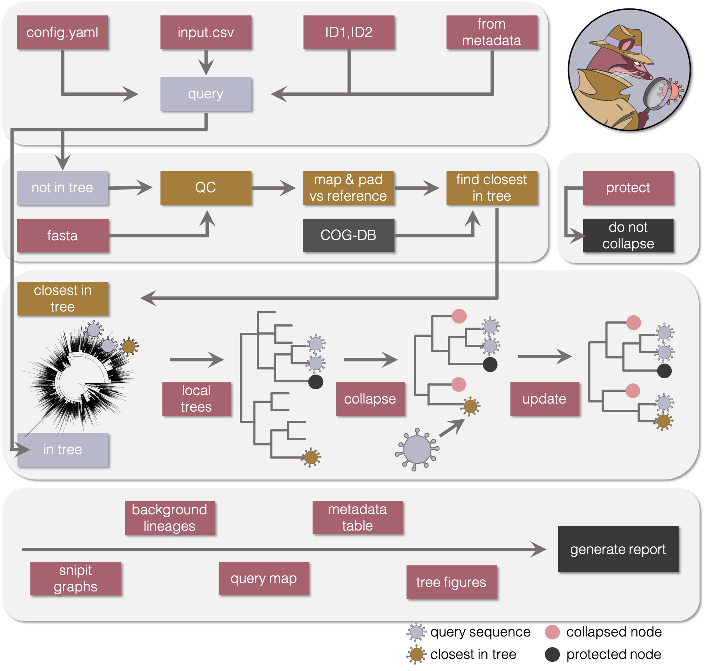

# civet

**C**luster **I**nvestigation & **V**irus **E**pidemiology **T**ool


### civet documentation
  * [Install and update civet](./docs/installation.md)
  * [Input options](./docs/input_options.md)
  * [Background data](./docs/background_data.md)
  * [Usage](./docs/usage.md)
  * [Analysis pipeline](./docs/analysis_pipeline.md)
  * [Output](./docs/output.md)
  * [Report options and descriptions](./docs/report_docs.md)
  * [Mapping options and usage instructions](./docs/map_options_docs.md)
  * [Example report](./docs/civet_report_example.md)
  * [Contributors & acknowledgements](./docs/acknowledgements.md)
  * [Software versions](./docs/acknowledgements.md)


<strong>civet</strong> was created by Áine O'Toole & Verity Hill, Rambaut Group, Edinburgh University

<strong> Find out more information about civet at https://cog-uk.github.io/civet/</strong>



<strong>civet</strong> is a tool developed with 'real-time' genomics in mind. 

Using a background phylogeny, such as the large phylogeny available through the COG-UK infrastructure on CLIMB, <strong>civet</strong> will generate a report for a set of sequences of interest i.e. an outbreak investigation. 

If the sequences are already on CLIMB and part of the large tree, <strong>civet</strong> will pull out the local context of those sequences, merging the smaller local trees as appropriate. If sequences haven't yet been incorporated into the large phylogeny, for instance if they have just been sequenced, <strong>civet</strong> will find the closest sequence in the large tree, pull the local tree of that sequence out and add your sequence in. The local trees then get collapsed to display in detail only the sequences of interest so as not to inform investigations beyond what was suggested by epidemiological data. 

A fully customisable report is generated, summarising information about the sequences of interest. The tips of these trees can be coloured by any categorical trait present in the input csv, and additional fields added to the tip labels. Optional figures may be added to describe the local background of UK lineages and to map the query sequences using coordinates, again colourable by a custom trait. 

#### Full usage:
```


                    __              __    
              ____ |__|__  __ _____/  |_ 
             / ___\|  \  \/ // __ \   __|
            \  \___|  |\   /\  ___/|  |  
             \____/ __| \_/  \____/ __|  

**** Cluster Investigation & Virus Epidemiology Tool ****

                        2.0
        ****************************************
                                                
            Aine O'Toole & Verity Hill       
                    Rambaut Group              
                Edinburgh University          


        Funding:                
                                                
                    ARTIC Network               
        Wellcome Trust Collaborators Award      
                    206298/Z/17/Z               
                                                
            COVID-19 Genomics UK Consortium     
        UK Department of Health and Social Care 
            UK Research and Innovation          
                                                
                    ReservoirDOCs               
      European Research Council Consolidator Grant
                    ERC-2016-COG                
                                                


        Code contributors:           
                                                
            Ben Jackson         gofasta       
            JT McCrone          clusterfunk     
            Stefan Rooke        local map 
            Andrew Rambaut      jclusterfunk    
                                                
        Acknowledgements:            
                                                
        We thank the following for helpful suggestions, 
        comments, beta-testing, feature requests and
        patience.                
                                                
            :nickloman:         :mattloose:     
            :mattbashton:       :tomconnor:     
            :rebeccadewar:      :martinmchugh:    
            :richardmyers:      :meerachand:    
            :samnicholls:       :radpoplawski:   
            :davidaanensen:     :benlindsey:    
            :jeffbarrett:       :derekfairley:   
            :josephhughes:      :davidrobertson:  
            :richardorton:      :mattholden:
            :ulfschaefer:       :nataliegroves:   
            :nikosmanesis:      :jaynaraghwani:   

usage: 
	civet -i <config.yaml> [options]
	civet -i input.csv [options]
	civet -i ID1,IS2 [options]
	civet -fm <column=match> [options]

input output options:
  -i INPUT, --input INPUT
                        Input config file in yaml format, csv file (with
                        minimally an input_column header, Default=`name`) or
                        comma-separated id string with one or more query ids.
                        Example: `EDB3588,EDB3589`.
  -fm [FROM_METADATA [FROM_METADATA ...]], --from-metadata [FROM_METADATA [FROM_METADATA ...]]
                        Generate a query from the metadata file supplied.
                        Define a search that will be used to pull out
                        sequences of interest from the large phylogeny. E.g.
                        -fm adm2=Edinburgh sample_date=2020-03-01:2020-04-01
  -o OUTDIR, --outdir OUTDIR
                        Output directory. Default: current working directory
  -f FASTA, --fasta FASTA
                        Optional fasta query.
  --max-ambiguity MAX_AMBIGUITY
                        Maximum proportion of Ns allowed to attempt analysis.
                        Default: 0.5
  --min-length MIN_LENGTH
                        Minimum query length allowed to attempt analysis.
                        Default: 10000

data source options:
  -d DATADIR, --datadir DATADIR
                        Local directory that contains the data files. Default:
                        civet-cat
  -m BACKGROUND_METADATA, --background-metadata BACKGROUND_METADATA
                        Custom metadata file that corresponds to the large
                        global tree/ alignment. Should have a column
                        `sequence_name`.
  --CLIMB               Indicates you're running CIVET from within CLIMB, uses
                        default paths in CLIMB to access data
  -r, --remote-sync     Remotely access lineage trees from CLIMB
  -uun UUN, --your-user-name UUN
                        Your CLIMB COG-UK username. Required if running with
                        --remote-sync flag
  --input-column INPUT_COLUMN
                        Column in input csv file to match with database.
                        Default: name
  --data-column DATA_COLUMN
                        Option to search COG database for a different id type.
                        Default: COG-UK ID

report customisation:
  -sc SEQUENCING_CENTRE, --sequencing-centre SEQUENCING_CENTRE
                        Customise report with logos from sequencing centre.
  --display-name DISPLAY_NAME
                        Column in input csv file with display names for seqs.
                        Default: same as input column
  --sample-date-column SAMPLE_DATE_COLUMN
                        Column in input csv with sampling date in it.
                        Default='sample_date'
  --colour-by COLOUR_BY
                        Comma separated string of fields to display as
                        coloured dots rather than text in report trees.
                        Optionally add colour scheme eg adm1=viridis
  --tree-fields TREE_FIELDS
                        Comma separated string of fields to display in the
                        trees in the report. Default: country
  --label-fields LABEL_FIELDS
                        Comma separated string of fields to add to tree report
                        labels.
  --date-fields DATE_FIELDS
                        Comma separated string of metadata headers containing
                        date information.
  --node-summary NODE_SUMMARY
                        Column to summarise collapsed nodes by. Default =
                        Global lineage
  --table-fields TABLE_FIELDS
                        Fields to include in the table produced in the report.
                        Query ID, name of sequence in tree and the local tree
                        it's found in will always be shown
  --include-snp-table   Include information about closest sequence in database
                        in table. Default is False
  --no-snipit           Don't run snipit graph
  --include-bars        Render barcharts in the output report
  --omit-appendix       Omit the appendix section. Default=False
  --private             remove adm2 references from background sequences.
                        Default=True

tree context options:
  --distance DISTANCE   Extraction from large tree radius. Default: 2
  --up-distance UP_DISTANCE
                        Upstream distance to extract from large tree. Default:
                        2
  --down-distance DOWN_DISTANCE
                        Downstream distance to extract from large tree.
                        Default: 2
  --collapse-threshold COLLAPSE_THRESHOLD
                        Minimum number of nodes to collapse on. Default: 1
  -p [PROTECT [PROTECT ...]], --protect [PROTECT [PROTECT ...]]
                        Protect nodes from collapse if they match the search
                        query in the metadata file supplied. E.g. -p
                        adm2=Edinburgh sample_date=2020-03-01:2020-04-01

map rendering options:
  --local-lineages      Contextualise the cluster lineages at local regional
                        scale. Requires at least one adm2 value in query csv.
  --date-restriction    Chose whether to date-restrict comparative sequences
                        at regional-scale.
  --date-range-start DATE_RANGE_START
                        Define the start date from which sequences will COG
                        sequences will be used for local context. YYYY-MM-DD
                        format required.
  --date-range-end DATE_RANGE_END
                        Define the end date from which sequences will COG
                        sequences will be used for local context. YYYY-MM-DD
                        format required.
  --date-window DATE_WINDOW
                        Define the window +- either side of cluster sample
                        collection date-range. Default is 7 days.
  --map-sequences       Map the sequences themselves by adm2, coordinates or
                        otuer postcode.
  --map-info MAP_INFO   columns containing EITHER x and y coordinates as a
                        comma separated string OR outer postcodes for mapping
                        sequences OR Adm2
  --input-crs INPUT_CRS
                        Coordinate reference system for sequence coordinates
  --colour-map-by COLOUR_MAP_BY
                        Column to colour mapped sequences by

misc options:
  -b, --launch-browser  Optionally launch md viewer in the browser using grip
  -c, --generate-config
                        Rather than running a civet report, just generate a
                        config file based on the command line arguments
                        provided
  --tempdir TEMPDIR     Specify where you want the temp stuff to go. Default:
                        $TMPDIR
  --no-temp             Output all intermediate files, for dev purposes.
  --verbose             Print lots of stuff to screen
  -t THREADS, --threads THREADS
                        Number of threads
  -v, --version         show program's version number and exit
  -h, --help
```
