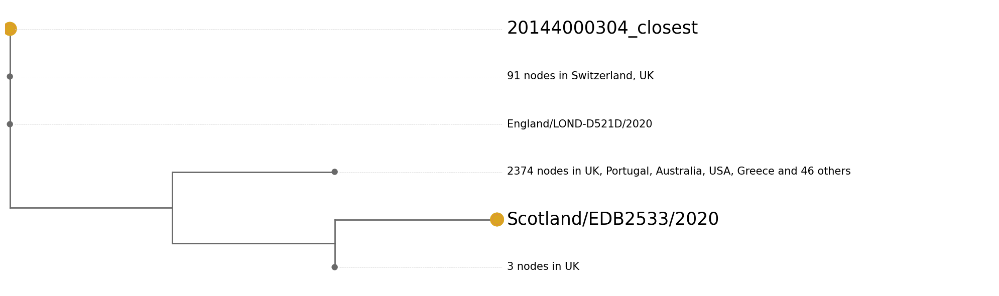
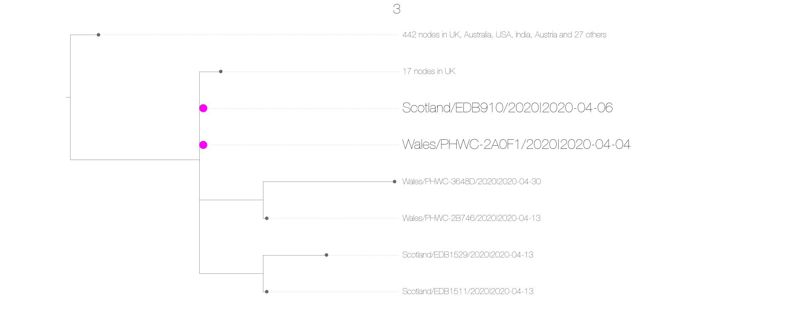

# Cluster investigation 

This report summarises the information provided by whole genome sequencing of SARS-COV-2 generated by the COG consortium. 
It is intended to provide an additional layer of analysis for infection control efforts, and to aid in the investigation of outbreak clusters.

For each query sequence, CIVET either finds them in the COG database, or matches them as closely as possible to a sequence in the COG database, and puts them into a UK lineage.

Key points for interpreting this information:

 - This type of analysis is not able to infer direct transmission between two samples. Even identical sequences may be unrelated as SARS-COV2 is relatively slow evolving for an RNA virus. Our analysis has shown that samples taken over 100 days apart can be identical (see Figure S1). 
 - If sequences have different global or UK lineage designations, we can rule out transmission.
 - If sequences have different phylotypes it’s very unlikely that they are direct transmissions. 
 - If sequences share the same lineage and the same phylotype, transmission cannot be ruled out and also cannot be confirmed.

The table below is a summary of the sequences provided with your metadata, along with their associated UK lineage and global lineage. For more information on these concepts, see the Appendix.
If you have provided additional information in the input csv, and specified that you would like it included in the analysis, it will also be displayed here.

| Query ID            | Part of COG   | Sequence name in COG   | Closest sequence in COG   | UK lineage   | Global lineage   | Phylotype   | sample_date   |
|:--------------------|:--------------|:-----------------------|:--------------------------|:-------------|:-----------------|:------------|:--------------|
| EDB129_closestb     | False         | NA                     | Wales/PHWC-2A0F1/2020     | UK156        | B.1.71           | UK156_1     | NA            |
| 20144000304_closest | False         | NA                     | England/LOND-D521D/2020   | UK63         | B.1.1            | UK63_1      | NA            |
| BRIS-12174F_closest | False         | NA                     | England/BRIS-12174F/2020  | UK611        | B.1.1            | UK611_1     | NA            |
| EDB3588             | True          | Scotland/EDB3588/2020  | NA                        | UK36         | B.1              | UK36_1.1.1  | 2020-04-27    |
| EDB2533             | True          | Scotland/EDB2533/2020  | NA                        | UK845        | B.1.1            | UK845_1     | 2020-04-23    |

The nearest neighbours of each of the query sequences are shown below in order to show their phylogenetic context.

This investigation's sequences are highlighted in pink.

\
\
\
\

## Appendix

The figure below shows the distribution of time differences that two sequences can be sampled and still be identical. 
It is to illustrate that identical sequences does not confirm linked cases.

\

### Useful definitions

*Phylotype* \
Each lineage phylogeny is labelled with phylotypes that describe shared mutations in the tree. If two sequences have the same phylotype it means the share mutations. They may also have additional, unique mutations. So having the same phylotype doesn't mean the seqeunces are identical. If sequences have different phylotypes however it means they are present on distinct parts of the phylogenetic tree.

*UK lineage* \
UK lineages are an approximation to distinct introductions of SARS-CoV-2 to the UK based on the phylogenetic tree.

*Global lineage* \
Assigned using the pangolin software, these are phylogenetic lineages. More information can be found at https://github.com/hCoV-2019/lineages

## Acknowledgements

This report was generated by CIVET.

The background data was generated by the COG consortium (https://www.cogconsortium.uk/), a national, multi-centre consortium for the sequencing and analysis of SARS-CoV-2 genomes for Public Health.

Tree data was visualised using baltic (https://github.com/evogytis/baltic)
